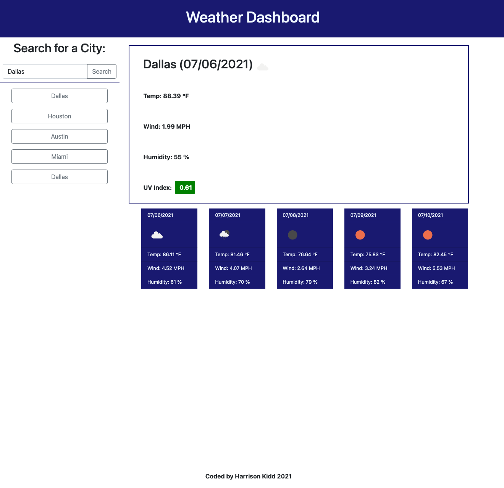

# WeatherDashboard_HW6
A weather dashboard that runs in the browser and features dynamically updated HTML and CSS.

## Purpose
The purpose of this homework assignment was to build a functional weather dashboard with a main forecast for the current day, with a color changing UV index, as well as a 5 day forecast using cards underneath.  This activity relied heavily on getting JavaScript, jQuery, Bootstrap, and Moment.js working together correctly along with saving to/retrieving from local storage.<br>

## Acceptance criteria
```
GIVEN a weather dashboard with form inputs

WHEN I search for a city
THEN I am presented with current and future conditions for that city and that city is added to the search history

WHEN I view current weather conditions for that city
THEN I am presented with the city name, the date, an icon representation of weather conditions, the temperature, the humidity, the wind speed, and the UV index

WHEN I view the UV index
THEN I am presented with a color that indicates whether the conditions are favorable, moderate, or severe

WHEN I view future weather conditions for that city
THEN I am presented with a 5-day forecast that displays the date, an icon representation of weather conditions, the temperature, the wind speed, and the humidity

WHEN I click on a city in the search history
THEN I am again presented with current and future conditions for that city
```
<br>

## The bulk of the challenege
As one of our first assignments involving the use of third-party API's, the difficulty here primarily resulted from figuring out the best ways to obtain the various weather data necessary to display on the various parts of the page.  

Saving past city searches to local storage and retrieving those values to pass into new fetch requests also posed a challenge.
<br>

## Example
Example image of my weather dashboard with previously searched cities showing on the left side within dynamically created buttons.



## End result
This is a fully functional weather dashboard allowing the user to search for (and locally save up to five) cities and their 5 day forecasts.  These forecasts prioritize the temperature, wind speeds, humidity, and UV index.  The UV index changes color to warns users about potentially harmful outdoor conditions, and weather icons denote the type of weather they might expect.


## Made with the help of + references
Previous boot camp exercises (Bootstrap, moment.js, event delegation, local storage, DOM manipulation) <br>
Jacob Guiro <br>
<br>

MDN Docs <br>
W3 Schools <br>
jQuery Docs <br>

## License
[MIT](https://choosealicense.com/licenses/mit/)
<br>

## Contact
Harrison Kidd <br>

harrisonakidd@gmail.com 

